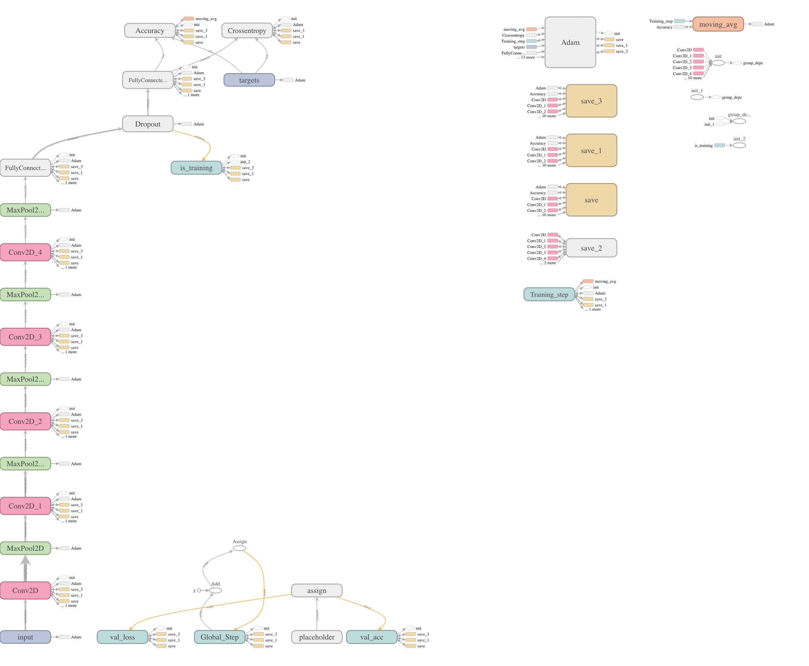
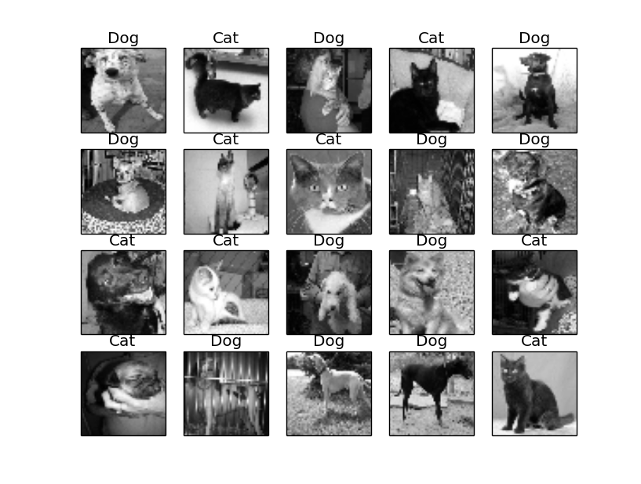

## Image Classifier using CNN

Link to the problem statement [Kaggle](https://www.kaggle.com/c/dogs-vs-cats)
Trained a Convolutional Neural Network to classify dogs and cat.

#### Getting Started

* Download files `[test1.zip](https://www.kaggle.com/c/dogs-vs-cats/download/test1.zip)` and `[train.zip](https://www.kaggle.com/c/dogs-vs-cats/download/train.zip)`.
* Unzip the files and store them data folder
* To run the classifier, excecute `python cnn_classifier.py`

#### Tensorflow Data Graph

#### Results

Sample classifications from the network

Accuracy: 83.2%
